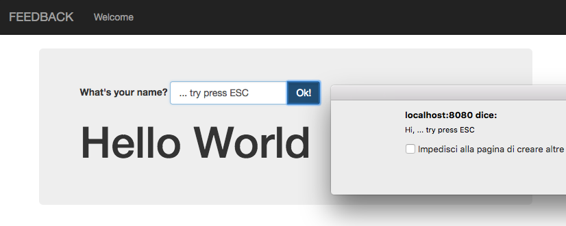

# XELabNG1-2

This repo was born as codelab for [my session of 2nd Dec 2016](http://www.xedotnet.org/eventi/lab-angular-1-to-2-lab/) about migration from Angular 1.x to NG2

It uses a simple sample: "the classic Hello World" angular application, but with some small tricks to modernize it 
(like [Bootstrap](http://getbootstrap.com/css/) styles and a little [directive](https://github.com/dmorosinotto/XELabNG1-2/blob/0-basics/src/app.js#L33-L55) to handle undo when you press ESC)

Here you'll find an **Intro Guide** [IT](docs/IT/ATeam.md) / [EN](docs/EN/ATeam.md) 
that explains the motivations and how to evolve you code from $scope to NG2 [step-by-step!](https://github.com/dmorosinotto/XELabNG1-2/commits/ng2) 
 
And one more thing: even if you are not interested in the [NG2](https://angular.io/) migration, 
I hope you can take the time to walk trought the commits, and possibly find/learn a "better way" to write an Angular 1.x app adopting 
 some common [best](https://github.com/johnpapa/angular-styleguide/blob/master/a1/README.md)-[practices](https://github.com/toddmotto/angular-styleguide), 
 and leveraging the power of [Typescipt](https://www.typescriptlang.org/) and [ng-metadata](https://github.com/ngParty/ng-metadata) 
 to have a cleaner codebase, even if you want to keep using [Angular 1.x](https://angularjs.org/).

`With all my <3 for the Angular Community` :sparkles::heart:

---

### SOME REFERENCE:
- [ng-metadata](https://github.com/ngParty/ng-metadata) official [documentation](https://hotell.gitbooks.io/ng-metadata/content/)
- Angular [Style guide](https://github.com/johnpapa/angular-styleguide/blob/master/a1/README.md) by [John Papa](https://twitter.com/John_Papa)
- Angular Style guide for [ES2015](https://github.com/toddmotto/angular-styleguide) and [TS](https://github.com/toddmotto/angular-styleguide/tree/master/typescript) by [Todd Motto](https://twitter.com/toddmotto)
- [Component architecture](https://teropa.info/blog/2015/10/18/refactoring-angular-apps-to-components.html) by [Tero Parviainen](https://twitter.com/teropa)
- [NG-Migrate](http://ngmigrate.telerik.com/) resources by KendoUI
- Official Angular2 [upgrade guide](https://angular.io/docs/ts/latest/guide/upgrade.html)
- Hybrid [ng1-NG2 app using Router](https://vsavkin.com/migrating-angular-1-applications-to-angular-2-in-5-simple-steps-40621800a25b#.ed3zf840d) by [Victor Savkin](https://twitter.com/victorsavkin)
- Getting to Angular2 [(video NGEurope 2016)](https://www.youtube.com/watch?v=2b-tEis9k4M) by [Jen Bourey](https://twitter.com/jbourey)
